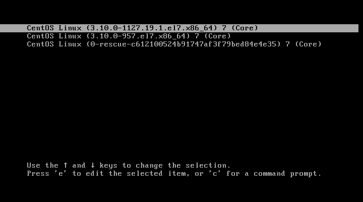
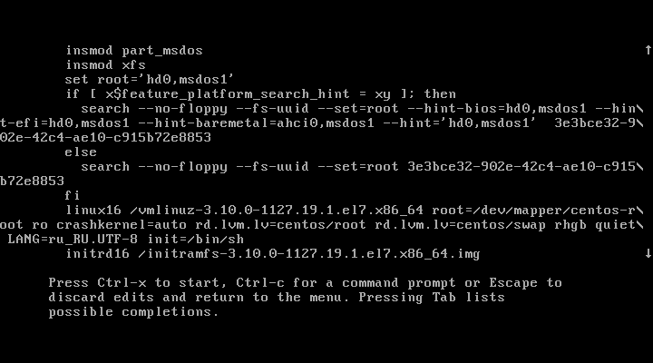
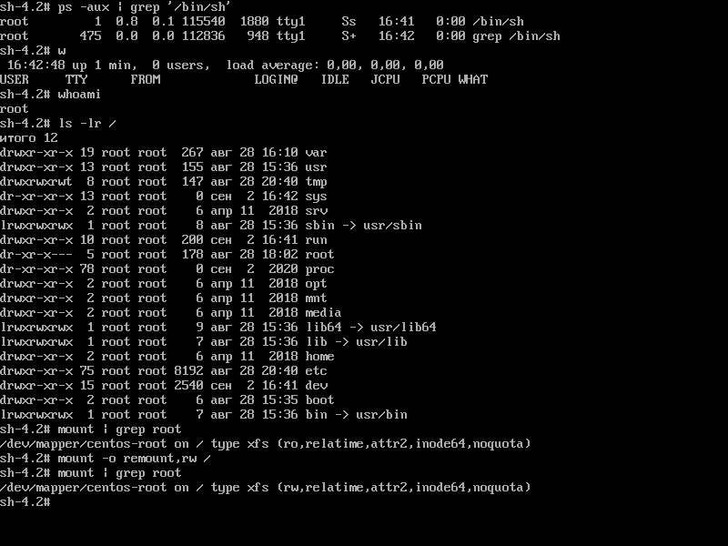

# **Домашнее задание №6: Загрузка системы**

## **Задание:**
Работа с загрузчиком
1. Попасть в систему без пароля несколькими способами
2. Установить систему с LVM, после чего переименовать VG
3. Добавить модуль в initrd

4(*). Сконфигурировать систему без отдельного раздела с /boot, а только с LVM
Репозиторий с пропатченым grub: https://yum.rumyantsev.com/centos/7/x86_64/
PV необходимо инициализировать с параметром --bootloaderareasize 1m
Критерии оценки: Описать действия, описать разницу между методами получения шелла в процессе загрузки.
Где получится - используем script, где не получается - словами или копипастой описываем действия.

---

## **Выполнено:**

### 1. Попадаем в систему без пароля несколькими способами:

#### Способ 1. init=/bin/sh
В конце строки начинающейся с linux16 добавляем init=/bin/sh (т.е. сообщаем ядру запустить /bin/sh как первый процесс с PID=1)и нажимаем сtrl-x для загрузки в систему.





Перемонтируем корневую систему в режиме Read-Write с проверкой
```bash
    mount -o remount,rw /
    mount | grep root
```

## **Полезное:**

