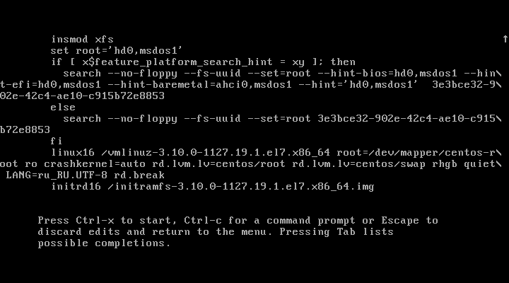
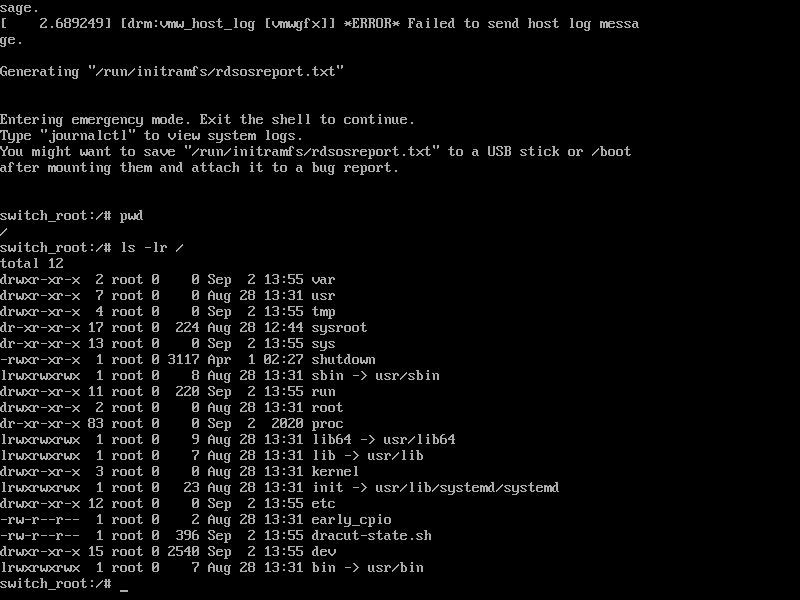
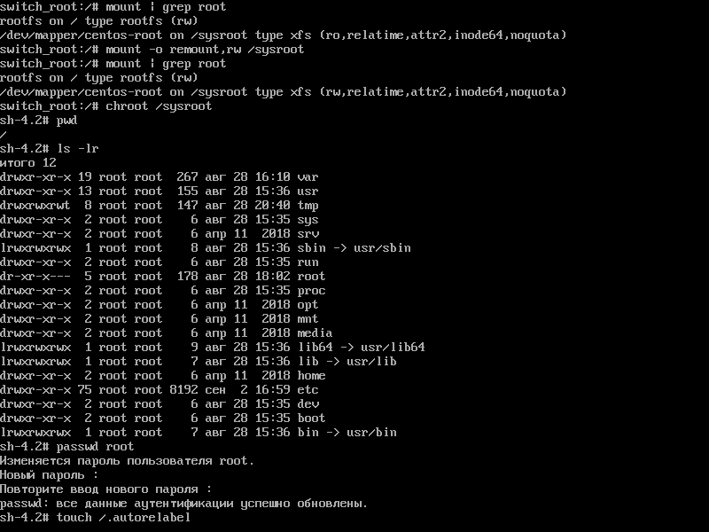
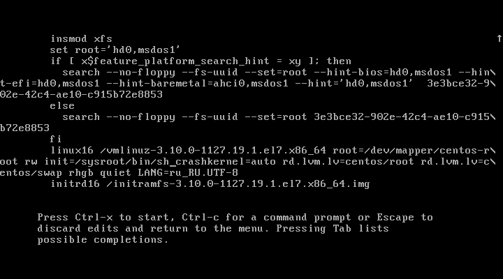
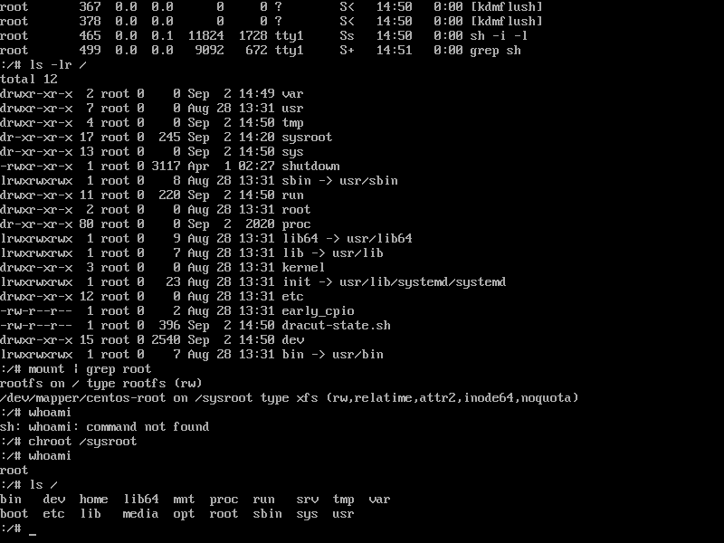
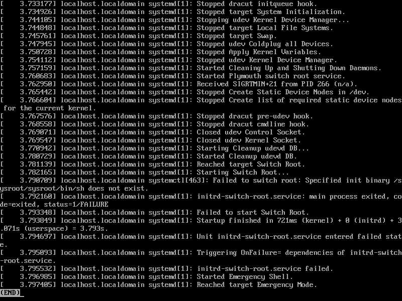
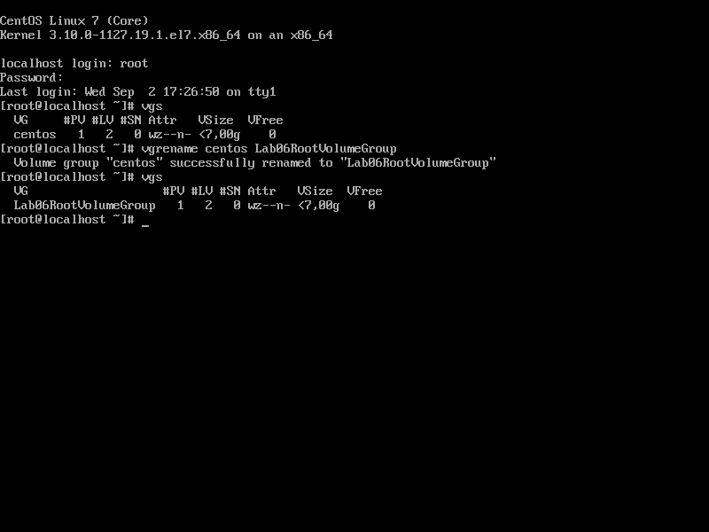
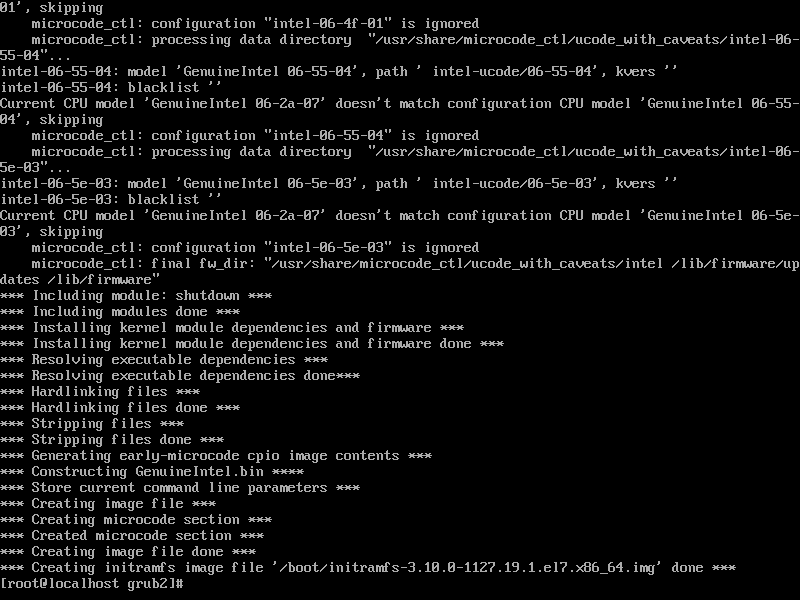
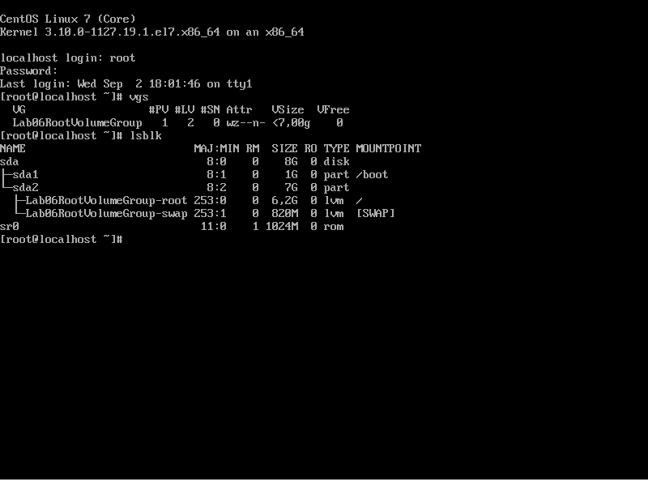

# **Домашнее задание №6: Загрузка системы**

## **Задание:**
Работа с загрузчиком
1. Попасть в систему без пароля несколькими способами
2. Установить систему с LVM, после чего переименовать VG
3. Добавить модуль в initrd

4(*). Сконфигурировать систему без отдельного раздела с /boot, а только с LVM
Репозиторий с пропатченым grub: https://yum.rumyantsev.com/centos/7/x86_64/
PV необходимо инициализировать с параметром --bootloaderareasize 1m
Критерии оценки: Описать действия, описать разницу между методами получения шелла в процессе загрузки.
Где получится - используем script, где не получается - словами или копипастой описываем действия.

---

## **Выполнено:**

### 1. Попадаем в систему без пароля несколькими способами:

#### Способ 1. init=/bin/sh
В конце строки начинающейся с linux16 добавляем init=/bin/sh (т.е. сообщаем ядру запустить /bin/sh как первый процесс с PID=1)и нажимаем сtrl-x для загрузки в систему.


Перемонтируем корневую систему в режиме Read-Write с проверкой
```bash
    mount -o remount,rw /
    mount | grep root
```

#### Способ 2. Через initrd, rd.break.

rd.break - даем инструкцию initrd запустить emergency mode и sh перед pivot_root()



Попадаем в emergency mode



Выполняем:
```
mount -o remount,rw /sysroot
chroot /sysroot
passwd root
touch /.autorelabel
```


Создание .autorelabel сообщает SELinux о необходимости запуска в initrd процесса restorecon(восстановления контекста) при последующей перезагрузке.

#### Способ 3. rw init=/sysroot/bin/sh



Наблюдаем в журнале /run/initramfs/rdsosreport.txt, что initrd не удалось запустить init=/sysroot/sysroot/bin/sh и система справедливо решила провалиться в Emergency Mode




### 2. Установливаем систему с LVM, после чего переименовываем VG

Смотрим текущее состояние системы и переименовываем Volume Group:


Правим [/etc/fstab](conf/fstab), [/etc/default/grub](conf/grub), [/boot/grub2/grub.cfg](conf/grub.cfg)

Пересоздаем initrd image, чтобы он знал новое название Volume Group
```bash
mkinitrd -f -v /boot/initramfs-$(uname -r).img $(uname -r)
```


Перегружаемся и проверяем:




## **Полезное:**

