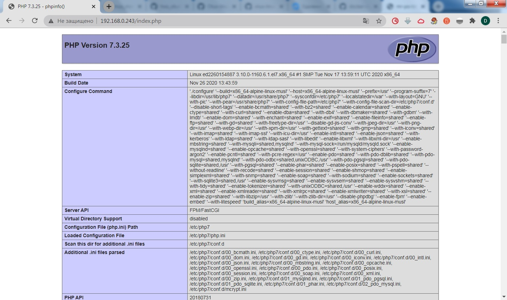

# **Домашнее задание №14: Docker**

## **Задание:**
Создайте свой кастомный образ nginx на базе alpine. После запуска nginx должен
отдавать кастомную страницу (достаточно изменить дефолтную страницу nginx)
Определите разницу между контейнером и образом
Вывод опишите в домашнем задании.
Ответьте на вопрос: Можно ли в контейнере собрать ядро?
Собранный образ необходимо запушить в docker hub и дать ссылку на ваш
репозиторий.

Задание со * (звездочкой)
Создайте кастомные образы nginx и php, объедините их в docker-compose.
После запуска nginx должен показывать php info.
Все собранные образы должны быть в docker hub

---

## **Выполнено:**


### **1. Создан свой кастомный образ nginx на базе alpine.**

- Для создания образа подготовлен следующий [Dockerfile](Dockerfile).

- Создаем образ:
```
[root@s01-deron lab14]# docker build -t deron73/my-nginx-image:0.1 --no-cache .
Sending build context to Docker daemon  7.68 kB
Step 1/7 : FROM alpine:3.12.1
Trying to pull repository docker.io/library/alpine ...
3.12.1: Pulling from docker.io/library/alpine
188c0c94c7c5: Pull complete
Digest: sha256:c0e9560cda118f9ec63ddefb4a173a2b2a0347082d7dff7dc14272e7841a5b5a
Status: Downloaded newer image for docker.io/alpine:3.12.1
 ---> d6e46aa2470d
Step 2/7 : MAINTAINER deron73@mail.ru
 ---> Running in fcc87adc4a52
 ---> d255f084632c
Removing intermediate container fcc87adc4a52
Step 3/7 : RUN set -x     && apk add --update nginx     && rm -rf /var/cache/apk/*     && ln -sf /dev/stdout /var/log/nginx/access.log     && ln -sf /dev/stderr /var/log/nginx/error.log
 ---> Running in 6c5f4fe79416

+ apk add --update nginx
fetch http://dl-cdn.alpinelinux.org/alpine/v3.12/main/x86_64/APKINDEX.tar.gz
fetch http://dl-cdn.alpinelinux.org/alpine/v3.12/community/x86_64/APKINDEX.tar.gz
(1/2) Installing pcre (8.44-r0)
(2/2) Installing nginx (1.18.0-r1)
Executing nginx-1.18.0-r1.pre-install
Executing busybox-1.31.1-r19.trigger
OK: 7 MiB in 16 packages
+ rm -rf /var/cache/apk/APKINDEX.2c4ac24e.tar.gz /var/cache/apk/APKINDEX.40a3604f.tar.gz
+ ln -sf /dev/stdout /var/log/nginx/access.log
+ ln -sf /dev/stderr /var/log/nginx/error.log
 ---> fd7d5e035516
Removing intermediate container 6c5f4fe79416
Step 4/7 : COPY default.conf /etc/nginx/conf.d/default.conf
 ---> 90874cc76c8c
Removing intermediate container bda834d9b3e3
Step 5/7 : COPY nginx.conf /etc/nginx/nginx.conf
 ---> 5941ff56cbc6
Removing intermediate container 6b3234b1011e
Step 6/7 : COPY index.html /usr/share/nginx/html/index.html
 ---> 6f4c34c5889d
Removing intermediate container 3f6401a219c5
Step 7/7 : CMD nginx -g daemon off;
 ---> Running in ff7ed5409cd9
 ---> b519d4ac8f3d
Removing intermediate container ff7ed5409cd9
Successfully built b519d4ac8f3d
```

- Проверяем факт создания:
```
[root@s01-deron lab14]# docker images | grep my-nginx-image
REPOSITORY                             TAG                 IMAGE ID            CREATED             SIZE
deron73/my-nginx-image                 0.1                 b519d4ac8f3d        2 minutes ago       6.98 MB
```
- Запускаем контейнер и проверяем работу:
```
[root@s01-deron lab14]# docker run -d -p 80:80 deron73/my-nginx-image:0.1
55a140f3736215267fc7d2578a4b7c6762e6ad71d2e77b330381623b0670f54c

[root@s01-deron lab14]# docker ps
CONTAINER ID        IMAGE                        COMMAND                  CREATED             STATUS              PORTS                NAMES
55a140f37362        deron73/my-nginx-image:0.1   "nginx -g 'daemon ..."   7 seconds ago       Up 6 seconds        0.0.0.0:80->80/tcp   ecstatic_payne

[root@s01-deron lab14]# curl localhost
<html>
<head>
<title>Welcome to Homework #14</title>
</head>
<body>
<h1>Welcome to Homework #14 </h1>
</body>
</html>
```

- Выкладываем в [Docker Hub](https://hub.docker.com/repository/docker/deron73/my-nginx-image)
```
[root@s01-deron lab14]# docker login
Login with your Docker ID to push and pull images from Docker Hub. If you don't have a Docker ID, head over to https://hub.docker.com to create one.
Username (deron73):
Password:
Login Succeeded
[root@s01-deron lab14]# docker push deron73/my-nginx-image:0.1
The push refers to a repository [docker.io/deron73/my-nginx-image]
69b2ccae4d9d: Pushed
a05ee65ce306: Pushed
286500af2476: Pushed
c78dad6aa0a4: Pushed
ace0eda3e3be: Mounted from library/alpine
0.1: digest: sha256:f6132ba7d5c8ddfa45c51760a10895e2634917f292667360a13f50bcffd8ef14 size: 1359
```

### **2. Выводы про разницу между контейнером и образом:**
Образ докера являются основой контейнеров. 
Образ - это упорядоченная коллекция изменений корневой файловой системы и соответствующих параметров 
выполнения для использования в среде выполнения контейнера. 
Образ обычно содержит объединение многоуровневых файловых систем, расположенных друг на друге. 
Образ не имеет состояния и никогда не изменяется.

**Контейнер - это исполняемый (остановленный) экземпляр образа docker.** 

Контейнер Docker состоит из:
- Docker образа 
- Среды выполнения
- Стандартного набора инструкций
Концепция заимствована из морских контейнеров, которые определяют стандарт для доставки товаров по всему миру. 
Docker определяет стандарт для отправки программного обеспечения.

(*) Взято из [Docker Glossary](https://docs.docker.com/glossary/)

Хотелось бы еще добавить, что из одного образа можно запустить множество контейнеров.

### **3. Ответьте на вопрос: Можно ли в контейнере собрать ядро?**

- Собрать возможно - [https://github.com/moul/docker-kernel-builde](https://github.com/moul/docker-kernel-builder). 

### **4. Задание со * (звездочкой)**

- Создан [Dockerfile](./nginx-php-fpm/php-fpm/Dockerfile) для создания образа с php-fpm
- Создан [docker-compose.yml](./nginx-php-fpm/docker-compose.yml)
- Запускаем и проверяем

```
[root@s01-deron nginx-php-fpm]# setenforce 0


[root@s01-deron nginx-php-fpm]# docker-compose up -d
Starting phpfpm ... done
Starting nginx ... done
```


## **Полезное:**

```
docker ps -a
docker inspect [OPTIONS] NAME|ID [NAME|ID...]
docker exec -it NAME|ID /bin/sh
docker logs NAME|ID
docker rm $(docker ps -aq)
docker run NAME --restart always#стартовать контейнер после перезагрузки хоста
docker run NAME --rm #удаление контейнера после остановки
docker network create BRIDGE_NAME
docker network ls
```
