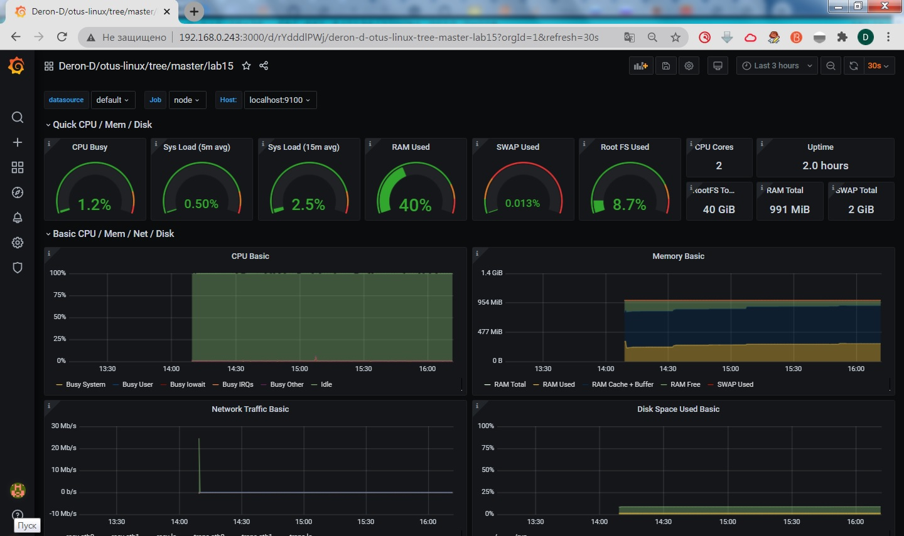

# **Домашнее задание №15: Настройка мониторинга **

## **Задание:**
Настройка мониторинга
Настроить дашборд с 4-мя графиками
1) память
2) процессор
3) диск
4) сеть

настроить на одной из систем
- zabbix (использовать screen (комплексный экран))
- prometheus - grafana

* использование систем примеры которых не рассматривались на занятии
- список возможных систем был приведен в презентации

в качестве результата прислать скриншот экрана - дашборд должен содержать в названии имя приславшего

---

## **Выполнено:**


1. Устанавливаем официальные роли с ansible-galaxy:
```
ansible-galaxy install --roles-path ./roles/ cloudalchemy.prometheus
ansible-galaxy install --roles-path ./roles/ cloudalchemy.node-exporter
ansible-galaxy install --roles-path ./roles/ cloudalchemy.grafana
```

2. Ставим Query language for JSON.
```
yum install python2-pip-8.1.2-14.el7.noarch
pip install --upgrade pip
pip install jmespath
```

3. Разрешаем порты на хостовой машине (порты в виртуалку пробросятся при её запуске)
```
firewall-cmd --permanent --add-port=3000/tcp --add-port=9090/tcp
firewall-cmd --reload
```

4. Заносим ноду в [targets.yml](./roles/cloudalchemy.prometheus/files/prometheus/targets/targets.yml)

5. Поднимаем стенд. Проверяем работу prometheus и node-exporter
```
vagrant up
vagrant ssh
curl 'localhost:9100/metrics'
curl 'localhost:9090/metrics'
```

6. Заходим в grafana. Настраиваем Data source и [Dashboard](https://grafana.com/grafana/dashboards/12486):



## **Полезное:**

Настройка Prometheus + Grafana
 - https://eax.me/prometheus-and-grafana/
 - https://grafana.com/docs/grafana/latest/installation/rpm/

 
 