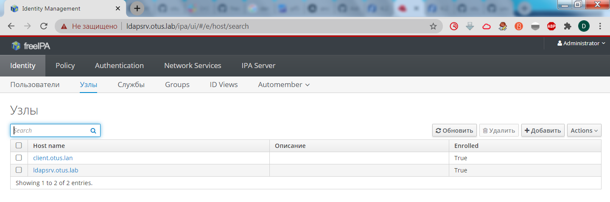
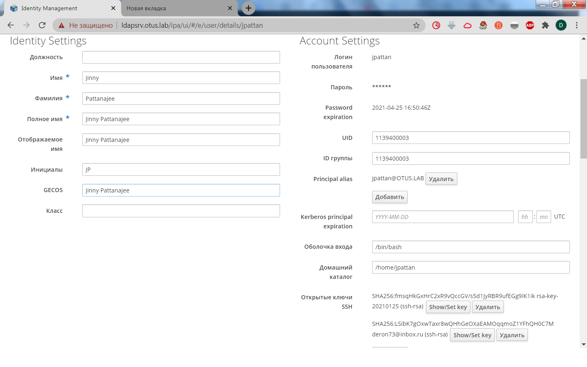

# **Домашнее задание №25: LDAP**

## **Задание:**
LDAP
1. Установить FreeIPA;
2. Написать Ansible playbook для конфигурации клиента;
3*. Настроить аутентификацию по SSH-ключам;
4**. Firewall должен быть включен на сервере и на клиенте.

В git - результирующий playbook.

---

## **Выполнено:**

#### Разворачиваем стенд:

```
git clone https://github.com/Deron-D/otus-linux && cd otus-linux/lab25 && git clone https://github.com/freeipa/ansible-freeipa.git && vagrant up && ansible-playbook playbook.yml
```


#### Пытаемся зайти в веб - консоль:



#### Проверяем статус FirewallD и пробуем завести пользователя на ipa сервере:
```
[root@s01-deron lab25]# vagrant ssh ldapsrv
Last login: Mon Jan 25 19:54:10 2021 from 10.0.2.2
[vagrant@ldapsrv ~]$ sudo -s
[root@ldapsrv vagrant]# systemctl status firewalld.service
● firewalld.service - firewalld - dynamic firewall daemon
   Loaded: loaded (/usr/lib/systemd/system/firewalld.service; enabled; vendor preset: enabled)
   Active: active (running) since Mon 2021-01-25 19:39:09 MSK; 33min ago
     Docs: man:firewalld(1)
 Main PID: 4201 (firewalld)
   CGroup: /system.slice/firewalld.service
           └─4201 /usr/bin/python2 -Es /usr/sbin/firewalld --nofork --nopid

Jan 25 19:39:09 ldapsrv.otus.lab systemd[1]: Starting firewalld - dynamic firewall daemon...
Jan 25 19:39:09 ldapsrv.otus.lab systemd[1]: Started firewalld - dynamic firewall daemon.
Jan 25 19:39:09 ldapsrv.otus.lab firewalld[4201]: WARNING: AllowZoneDrifting is enabled. This is considered an insecure configurati...it now.
Hint: Some lines were ellipsized, use -l to show in full.


[vagrant@ldapsrv ~]$ ipa user-add --first="Jinny" --last="Pattanajee" --cn="Jinny Pattanajee" --password jpattan --shell="/bin/bash"         Password:
Enter Password again to verify:
--------------------
Added user "jpattan"
--------------------
  User login: jpattan
  First name: Jinny
  Last name: Pattanajee
  Full name: Jinny Pattanajee
  Display name: Jinny Pattanajee
  Initials: JP
  Home directory: /home/jpattan
  GECOS: Jinny Pattanajee
  Login shell: /bin/bash
  Principal name: jpattan@OTUS.LAB
  Principal alias: jpattan@OTUS.LAB
  User password expiration: 20210125164942Z
  Email address: jpattan@otus.lab
  UID: 1139400003
  GID: 1139400003
  Password: True
  Member of groups: ipausers
  Kerberos keys available: True
```

#### Проверяем на клиенте:

```
[root@s01-deron lab25]# vagrant ssh client
Last login: Mon Jan 25 19:45:03 2021 from 10.0.2.2
[vagrant@client ~]$ su - jpattan
Password:
Password expired. Change your password now.
Current Password:
New password:
Retype new password:
Creating home directory for jpattan.
```

#### Добавляем публичный ключ для jpattan через веб - консоль:




#### Проверяем с хостовой машины, пробуя зайти на client:
```
[root@s01-deron lab25]# ssh jpattan@127.0.0.1 -p 2200
Last login: Mon Jan 25 19:50:46 2021
```

## **Полезное:**

