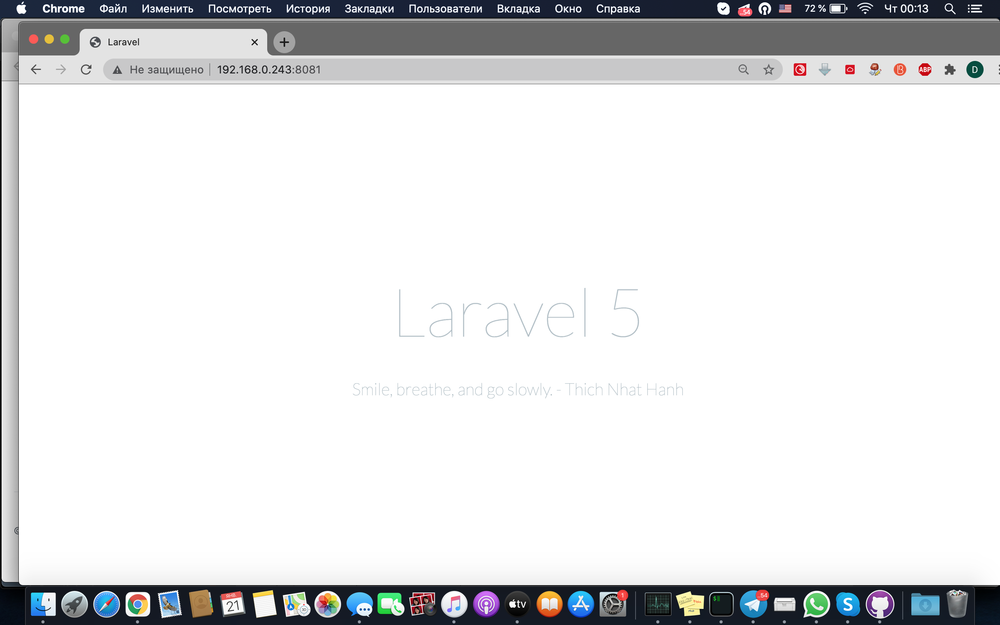
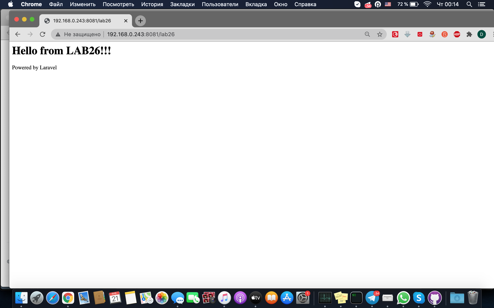
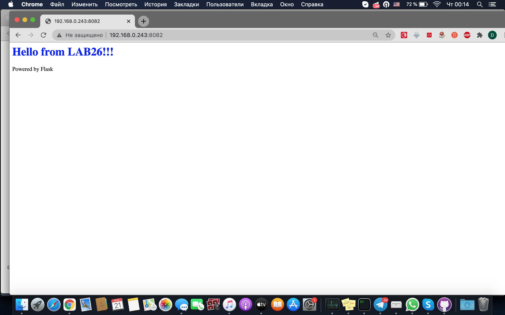
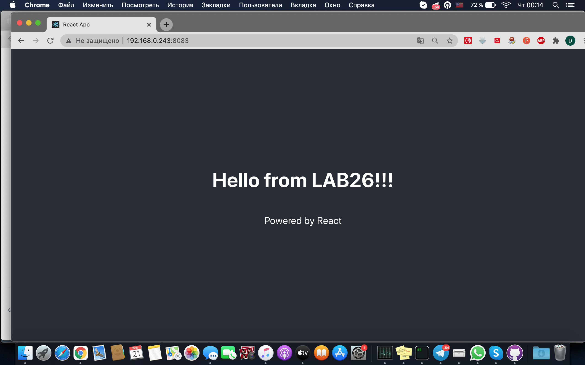

# **Домашнее задание №26: Динамический веб**

## **Задание:**
развернуть стенд с веб приложениями в vagrant
Варианты стенда

nginx + php-fpm (laravel/wordpress) + python (flask/django) + js(react/angular)

nginx + java (tomcat/jetty/netty) + go + ruby

можно свои комбинации

Реализации на выбор
- на хостовой системе через конфиги в /etc
- деплой через docker-compose

Для усложнения можно попросить проекты у коллег с курсов по разработке

К сдаче примается
vagrant стэнд с проброшенными на локалхост портами
каждый порт на свой сайт
через нжинкс
---

## **Выполнено:**

#### Поднимаем стенд:
```
git clone https://github.com/Deron-D/otus-linux && cd otus-linux/lab26 && vagrant up
```

#### В (моем) случае хостовой машины с Centos7 и включенным FirewallD временно добавляем правила:
```
firewall-cmd --add-port=8081-8083/tcp
```

#### Проверяем:

- [Laravel http://192.168.0.243:8081/](http://192.168.0.243:8081)
- [Laravel (проект) http://192.168.0.243:8081/lab26](http://192.168.0.243:8081/lab26)
- [Flask http://192.168.0.243:8082/](http://192.168.0.243:8082/)
- [React http://192.168.0.243:8083/](http://192.168.0.243:8083/)

#### Убираем правила:
```
firewall-cmd --remove-port=8081-8083/tcp
```









## **Полезное:**

