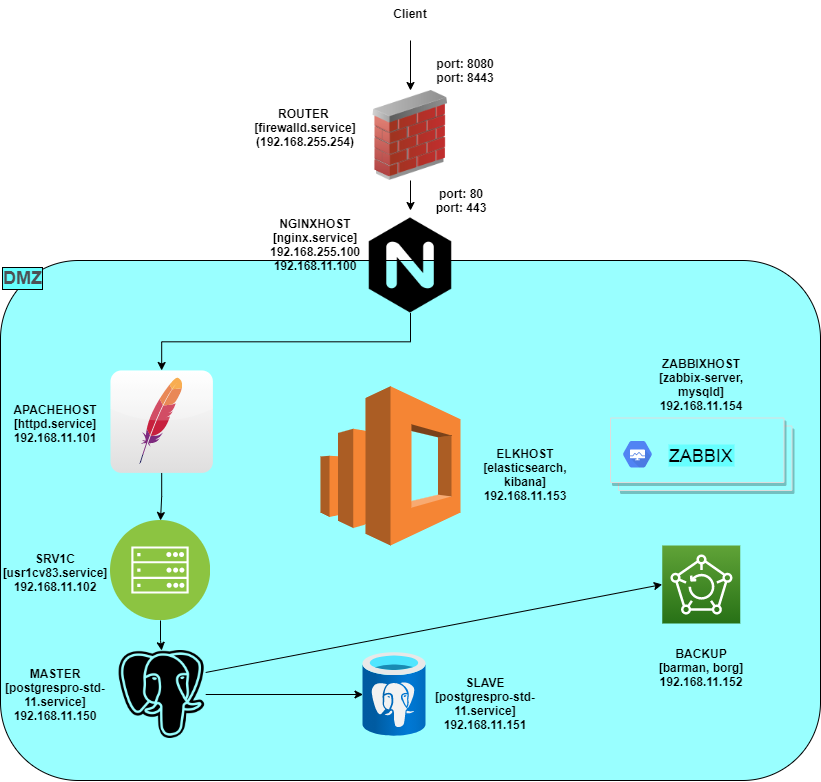

# **Проект**
Цель:
Создание рабочего проекта  
веб проект с развертыванием нескольких виртуальных машин должен отвечать следующим требованиям

- включен https
- основная инфраструктура в DMZ зоне
- файрвалл на входе
- сбор метрик и настроенный алертинг
- везде включен selinux
- организован централизованный сбор логов

## **Тема:**

### **Infrastructure as code на примере развертывания защищенного окружения для публикации решений на платформе 1С с реализацией централизованного сбора логов, мониторинга и резервного копирования**

---

## **Выполнено:**

**Состав окружения:**
- Frontend (nginx.otus.lab): [https://host:8443/1CDocDemo/ru_RU/](https://192.168.0.103:8443/1CDocDemo/ru_RU/)
- Сервер публикаций (apachehost.otus.lab)
- Сервер приложений 1c v8.3 (srv1c.otus.lab)
- Сервер СУБД PostgreSQL (master.otus.lab)
- Сервер реплики основной базы (slave.otus.lab)
- Сервер резервного копирования (Barman + Borg) (backup.otus.lab )
- Сервер системы мониторинга (zabbixhos.otus.lab): [http://host:2088/](http://192.168.0.103:2088/)
  Введите имя пользователя Admin с паролем zabbix для входа под Супер-Администратором Zabbix
- Сервер централизованного сбора логов: [http://host:5601/app/home#/](http://192.168.0.103:5601/app/home#/).
  Kibana index pattern пока нужно создавать вручную: [http://host:5601/app/management/kibana/indexPatterns/create](http://192.168.0.103:5601/app/management/kibana/indexPatterns/create)



## **Инструкции:**

1. Убиваем и восстанавливаем stateless srv1c.otus.lab:
```
vagrant destroy srv1c -f
vagrant up srv1c
ansible-playbook provision/playbook.yml --ask-vault-pass --tags "pre_init,1c_install,1c_setup"
```

2. Ложим master.otus.lab и переключаем на slave.otus.lab:
```
vagrant suspend master

vagrant ssh srv1c
Last login: Thu May 13 17:05:27 2021 from 10.0.2.2
[vagrant@srv1c ~]$ sudo -s
[root@srv1c vagrant]# su usr1cv8
[usr1cv8@srv1c vagrant]$ cd
[usr1cv8@srv1c ~]$ ./switch_replica.sh
9d2baada-7244-43c2-833c-deea45e12355
4d8f216d-3048-4a6a-8e31-6eb00c2da1bb
2d63dc01-efd1-479b-b150-12311bababce
Insufficient user rights for infobase 1CDocDemo
infobase                                   : 4d8f216d-3048-4a6a-8e31-6eb00c2da1bb
name                                       : 1CDocDemo
dbms                                       : PostgreSQL
db-server                                  : slave.otus.lab
db-name                                    : 1CDocDemo
db-user                                    : barman
security-level                             : 0
license-distribution                       : allow
scheduled-jobs-deny                        : off
sessions-deny                              : off
denied-from                                :
denied-message                             :
denied-parameter                           :
denied-to                                  :
permission-code                            :
external-session-manager-connection-string :
external-session-manager-required          : no
security-profile-name                      :
safe-mode-security-profile-name            :
reserve-working-processes                  : no
descr                                      :


vagrant ssh slave
[root@slave vagrant]# echo 1 > /tmp/trigger.file
```


## **Полезное:**

**ELK**

Проверка работы базы данных:
```
curl -GET localhost:9200/_cat/health?v
```

ELK cluster state
```
curl -GET 'localhost:9200/_cluster/state?pretty'
```

Просмотр индексов в базе:
```
curl -GET localhost:9200/_cat/indices?v
```
- [Перенос базы PostgreSQL с сервера на сервер](https://shra.ru/2017/01/perenos-bazy-postgresql-s-servera-na-server/)
- [Простая установка 1С на Linux (Ubuntu)](https://wiseadvice-it.ru/o-kompanii/blog/articles/prostaya-ustanovka-1s-na-linux-ubuntu/)
- [Firewalld Rich and Direct Rules: Setting up RHEL 7 Server as a Router](https://www.lisenet.com/2016/firewalld-rich-and-direct-rules-setup-rhel-7-server-as-a-router/)
- [Firewalld : IP Masquerade](https://www.server-world.info/en/note?os=CentOS_7&p=firewalld&f=2)
- [Firewalld, установка и настройка, зоны, NAT, проброс портов](https://itproffi.ru/firewalld-ustanovka-i-nastrojka-zony-nat-probros-portov/)


